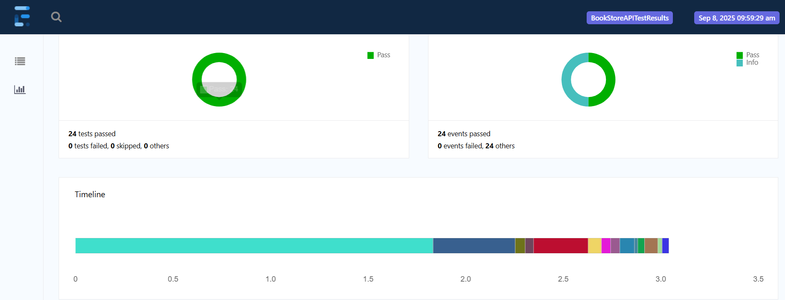

A comprehensive test automation suite for the BookStore API, developed using Java with RestAssured and FastAPI. This project supports multiple environments (QA, Dev, Prod) and includes CI/CD pipelines for seamless integration and testing.

## How to Run the Tests

### Prerequisites

- Maven 3.8.4+
- Java 17+
- Git
- Any IDE (e.g., IntelliJ IDEA, Eclipse, VS Code)
- Run Book Store API on local machine after reading the Bookstore API's own README.md file

### Steps to Execute

1. Clone the repository:
   ```bash
   git clone https://github.com/your-username/bookapi-tests.git
   cd RestAssuredRasu
2. set env as QA in config file using, env=QA
3. Run the Scenarios
   ```bash
   mvn clean test
4.  Reports are generated with a time stamped named for easy identification
    cd BookStoreRasu/extentreports

🧪 ### Running Tests in CI

The project includes a GitHub Actions workflow located at .github/workflows/maven.yml. This workflow:

Installs Python dependencies and starts the FastAPI server.

Runs the Java tests using Maven.

### To manually trigger the workflow:

Navigate to the Actions tab in the GitHub repository.

Select the desired workflow.

Click the Run workflow button.    

## 📊 Test Reports
- 

## Validation Covered

1. Header and body validations are covered in response extractor for testcases
2. Schema validation is built into the response extractor
3. Status code validation is also validated into response extractor.
4. Negative test cases are included as well.


## Project Structure Implementation Details

- Each API request is mapped to a corresponding **test class** with the same name.  
  Example: *UpdateBook* request is tested in **`UpdateBook.java`**.

- A single test class can contain **multiple test cases**.

- **Records** are used for serialization and deserialization of request and response bodies.


#### ApiMethods
- Handles sending HTTP requests: `GET`, `POST`, `PUT`, `DELETE`.
- Accepts **path parameters** and **query parameters**,body, status code
#### SpecBuilder
- Provides reusable request/response specifications.

#### Response Extractor
- provides common methods for validating response, includes overriding methods to provide flexibility for diffrent inputs

#### Data-Driven Testing
- Implemented using **`@DataProvider`** to supply multiple input sets using iterator for test cases.

#### Assertions
- Hamcrest assertions
- Schema validation by Json schema validator 
- TestNG assertions

#### Schema Management
- JSON Schemas for expected responses are stored in a **dedicated folder** for better organization.

## Testing Strategy
- request chaining was done for sharing token, new email, new pwd.

- `**POSTIVE WORKFLOW** health Check up>> creation of new user >> login to get access token >> get all books >> create new Book >> Validating of new book is displayed in the list of all the books >> getting newly created book by ID >> update newly added book >> check this newly added book in list of all the book >> Delete newly added book >> Delete all books`

- `**NEGATIVE TESTCASES** Validating creation of new user with existing email, Login using incorrect _SET OF_ credentails, Validating if books are not displayed when invalid token used, Validating if books are not displayed when NO token used, Validating user unable to search a book with incorrect ID, try to twice delete a book, unable to search deleted book, Incorrectly formatted JSON file validation, validating using expired and incorrect token`
- Records used for serialization and deserialization
- Negative testcases are covered.
- validation of Body, header, status code, schema is also covered.
- @DataProvider is to supply multiple input sets for test cases.
- yml file for **gitHub action** has been added

## List of issues
-  I am  unable to create *Invalid JSON Request Body** which could give us 422 status using POJO classs .
   Instead of relying on serialization, I build the string manually.
- When incorrect credentials are provided during login, the server responds with a 400 Bad Request instead of a 401 Unauthorized.
- During the login request validation, I found that the request is processed regardless of the provided user ID.
- If a user tries to retrieve all books with an incorrect token, they receive a 403 Forbidden error instead of a 401 Unauthorized.
- When attempting to add a new book with an existing ID, the server returns a 500 Internal Server Error, indicating it cannot handle duplicate IDs.
- There is currently no functionality to delete users, making test data cleanup impossible.
    
📁 Project Structure

```

src/main/java/
|
└── .github/workflows/maven.yml         # GitHub Actions CI pipeline
└── api/bookstore/                      # Actual api
|
└── com/bookstoreapi/
    │      
    │── apiendpoints/
    │   └── APIEndpoints.java           # All API endpoint paths as constants for easy reuse and maintainability.      
    │
    ├── apimethods
    │   ├── BaseAPI.java                # Core API methods 
    │   └── BookStoreAPI.java           # Endoint mapped and structured to use core reusable API methods
    |   └── SpecBuilder.java            # Request or Response reusable common specs
    |   └── ResponseExtractor.java      # Common methods for validating response
    │   
    │
    ├── data
    │   └── Datagenerator.java          # ExtentReports setup by integrating with ITestListener to generate HTML test report
    │   └── UserData.java               # Provides data for the test 
    │
    ├── listener
    │   └── ListenerClass.java          # For listening testcase events
    └── model                  
    │   └── request/                    # Model the request payload 
    │   └── response/                   # Model the rsponse body
    │
    │── utils/
    │   └── ConfigReader.java           # access config.properties file
    │   
       
src/test/java/
└── com/bookapi/testcases/              # All the testcases are written here
                         
src/test/resources/
└── schemas/                            # contains the response schemas for validation

config.properties                       
pom.xml                                     
testng.xml


